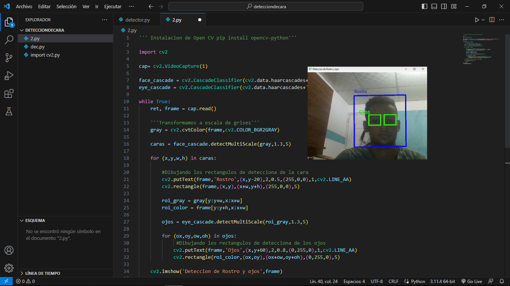

# Deteccion de ojos
Para iniciar vamos a necesitar algunas herramientas necesarias para la creación

Prosedemos a instalar las librerias 
-pip install opencv-python

Una vez importada comenzamos a realizar el codigo:

''' Instalacion de Open CV pip install opencv-python'''

import cv2

cap= cv2.VideoCapture(1)

face_cascade = cv2.CascadeClassifier(cv2.data.haarcascades+'haarcascade_frontalface_default.xml')
eye_cascade = cv2.CascadeClassifier(cv2.data.haarcascades+'haarcascade_eye.xml')

while True:
    ret, frame = cap.read()

    '''Transformamos a escala de grises'''
    gray = cv2.cvtColor(frame,cv2.COLOR_BGR2GRAY)
    
    caras = face_cascade.detectMultiScale(gray,1.3,5)

    for (x,y,w,h) in caras:

        #Dibujando los rectangulos de detecciona de la cara
        cv2.putText(frame,'Rostro',(x,y-20),2,0.5,(255,0,0),1,cv2.LINE_AA)
        cv2.rectangle(frame,(x,y),(x+w,y+h),(255,0,0),5)

        roi_gray = gray[y:y+w,x:x+w]
        roi_color = frame[y:y+h,x:x+w]

        ojos = eye_cascade.detectMultiScale(roi_gray,1.3,5)

        for (ox,oy,ow,oh) in ojos:
             #Dibujando los rectangulos de detecciona de los ojos
            cv2.putText(frame,'Ojos',(x,y+60),2,0.8,(0,255,0),1,cv2.LINE_AA)
            cv2.rectangle(roi_color,(ox,oy),(ox+ow,oy+oh),(0,255,0),5)
        
    cv2.imshow('Deteccion de Rostro y ojos',frame)

    if(cv2.waitKey(1)==ord('q')):
        break

cap.release()
cv2.destroyAllWindows()
Finalmente ejecutamos nuestro proyecto y vamos a tener nuestro software funcionando correctamente

